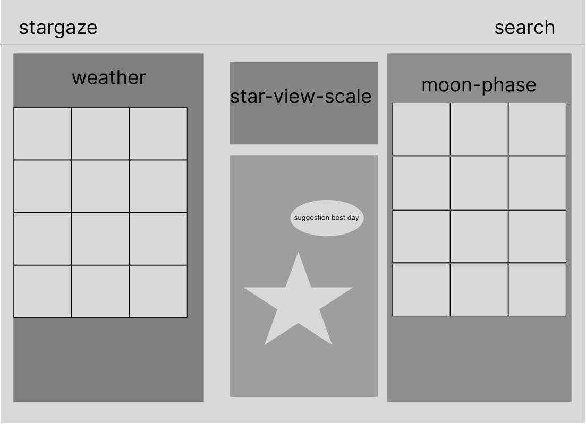
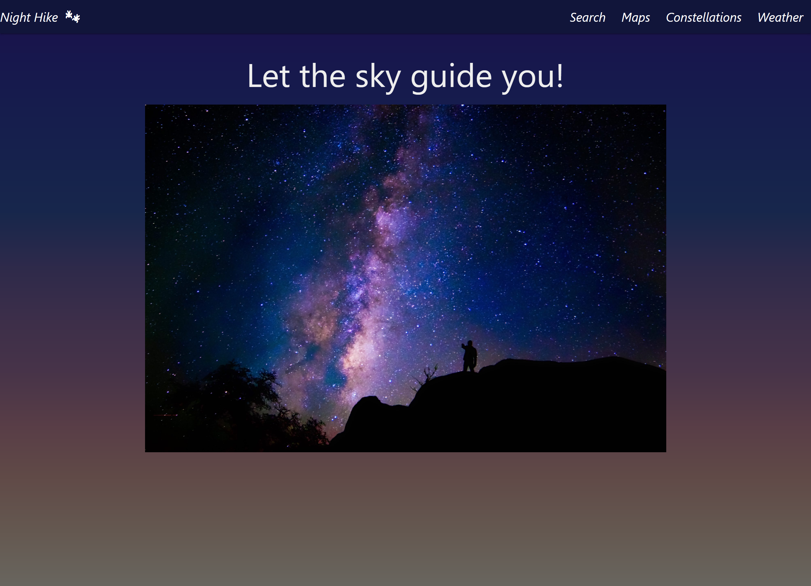
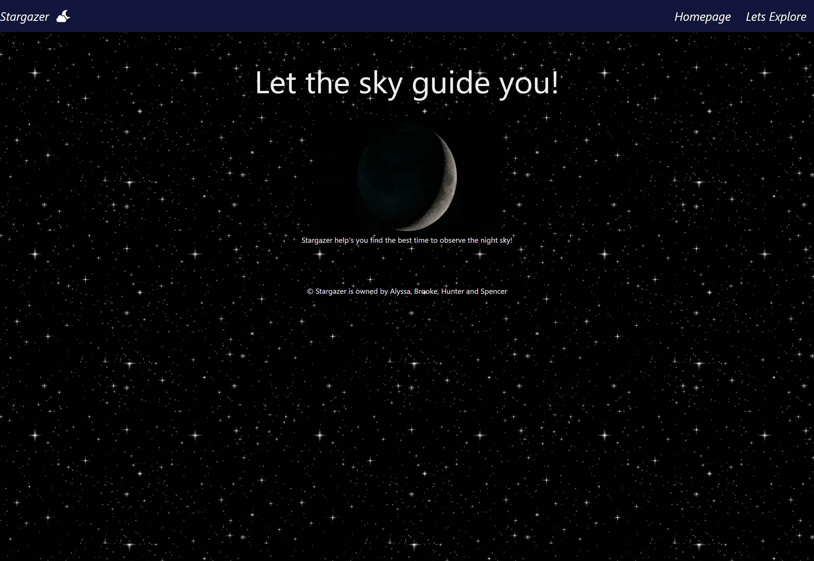
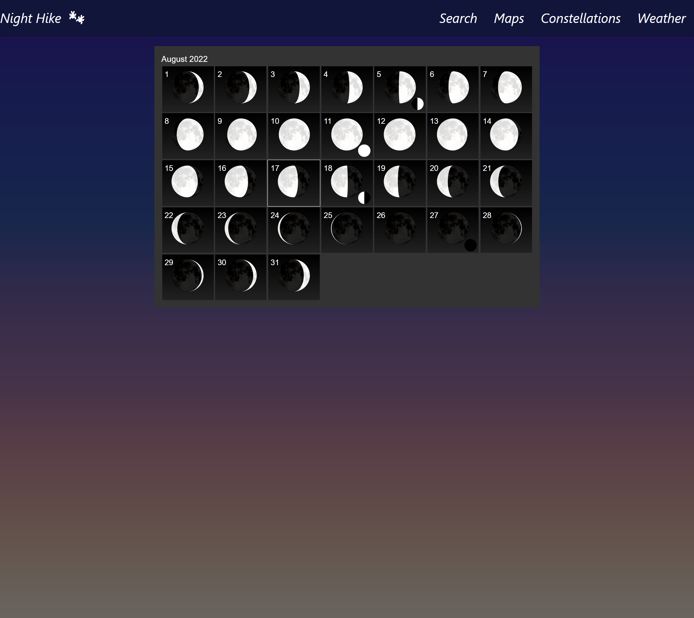
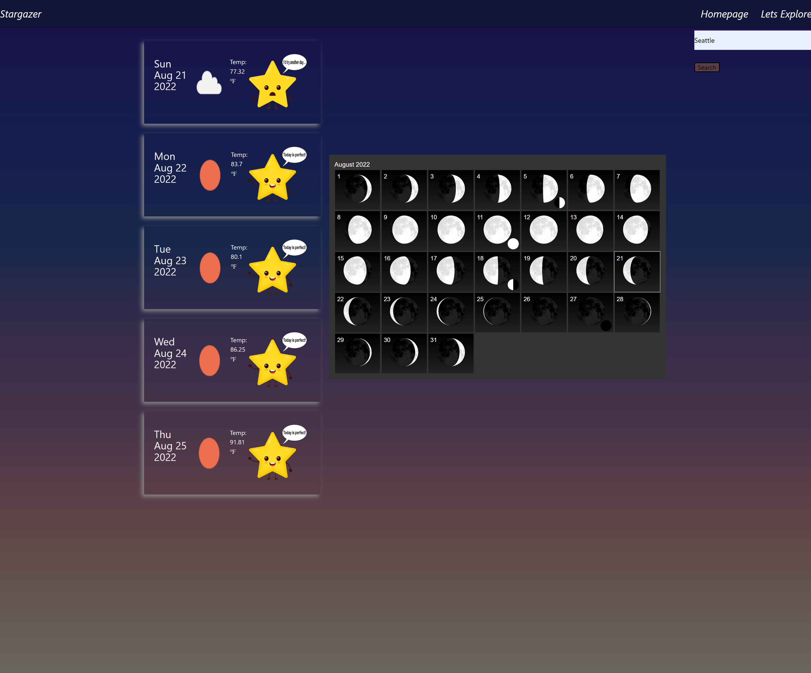

# Night Hike

## Api Project Description
-   Display forecast calender of weather and moon phase
-   display current day
-   recommend optimal weather and moon phase date
-   save search history to local storage

- As a client, I want to know then it will be a clear day to see the stars and the moon.
- WHEN I open the homepage,
- THEN I see a clear UI with a description homepage
- WHEN I click “let's explore”
- THEN i’m brought to a page with a search bar
- WHEN I click on the search bar and type in my preferred city
- THEN the weather will populate on the left with a smiley or sad face indicating it’s a good time to go stargazing.

## Stretch Goal
-   Add in hiking trails/map
-   Add constellations map

[Git Pages](https://night-hike.github.io/night-hike/)
[Repo Link](https://github.com/night-hike/night-hike)

## Team
-  Spencer  - Frontend
-  Alyssa   - Frontend

-  Hunter   - Backend
-  Brooke   - Backend

### Resources
-   [Materialize](https://cdnjs.cloudflare.com/ajax/libs/materialize/1.0.0/css/materialize.min.css)
-   [Weather API](http://api.openweathermap.org)
-   [Font Awesome](https://kit.fontawesome.com/73f5b40986.js)
-   [Wdisseny (Moon Phases)](http://www.wdisseny.com/lluna/?lang=en)
